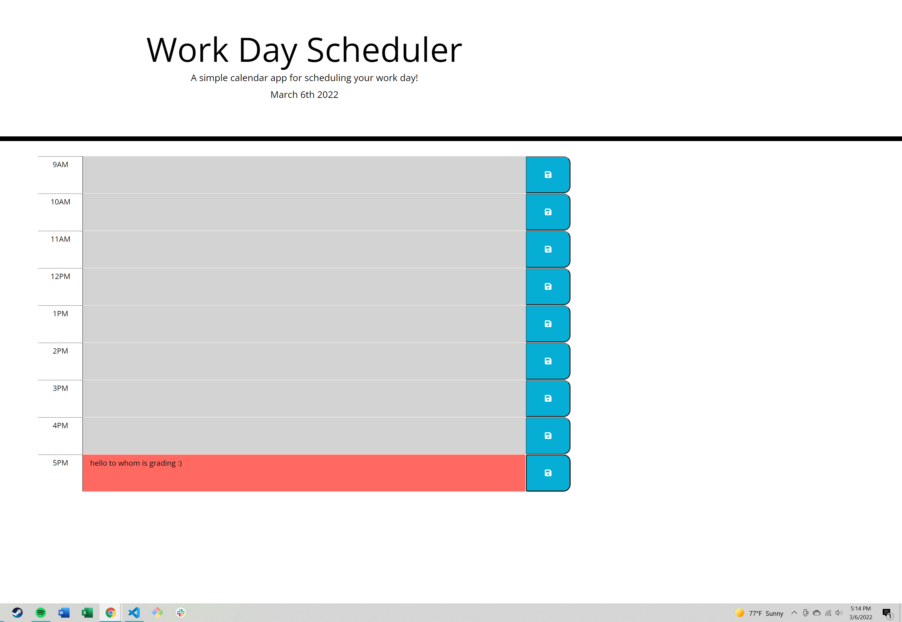

# work-day-scheduler
## Challenge Assignment 5

## Link to code:
https://github.com/jamesbelk0/work-day-scheduler

## Link to site: 
https://jamesbelk0.github.io/work-day-scheduler/

## Link to screenshot:

### Description

1. Build frame for the actual schedule and get hourly segments

2. Used Moment.js to get the time to always be on the current day/time

3. Added time and color based on the time of the day and accessing the schedule. 

4. Updated repo and updated README 